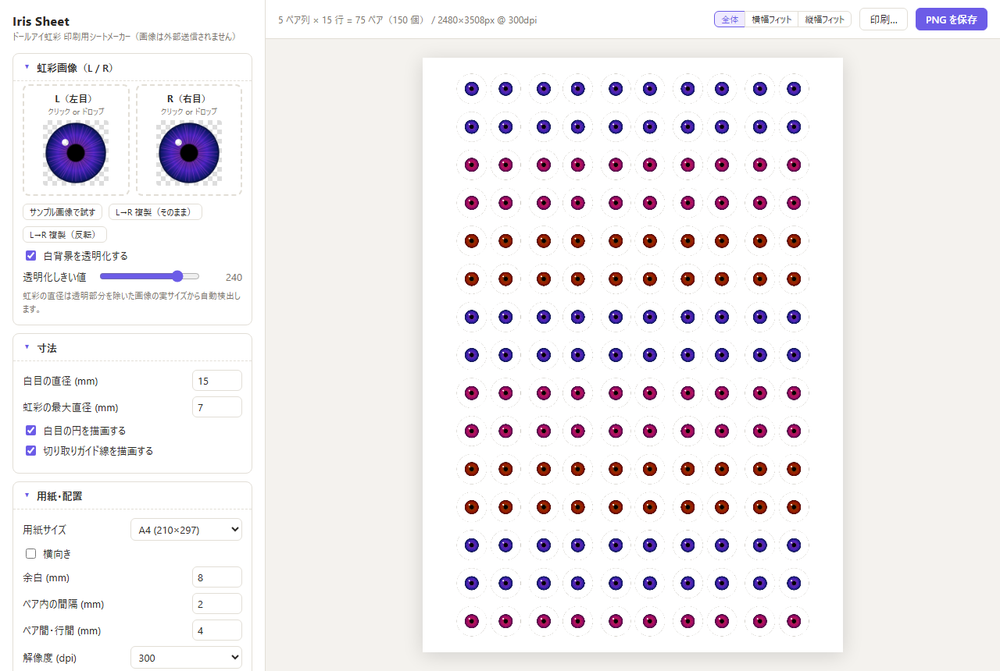

# Iris Sheet

ドールアイの虹彩画像を印刷用に敷き詰めるシートを、ブラウザだけで作れるツールです。
インストール不要・ビルド不要・**画像はどこにも送信されません**（すべてブラウザ内で処理）。

## 👉 ここで使えます

**https://doujimakobo.github.io/iris-sheet/**

手持ちの画像なしで試すなら [サンプル入りデモ](https://doujimakobo.github.io/iris-sheet/?sample=1) をどうぞ。

## 使い方

1. 上記 URL を開く（`index.html` をローカルで開いても同じに動きます）
2. L（左目）/ R（右目）の虹彩画像をドロップ
3. 白目の直径（既定 15mm）と虹彩の最大直径（既定 7mm）を設定
4. 用紙サイズ（A4 / A3 / B5 / はがき / L判 / 2L判 / レター）を選ぶ
5. 「PNG を保存」で実寸 DPI 情報つきの PNG を出力、または「印刷…」でそのまま印刷

## 機能

- **白背景の自動透明化** — 白目部分が不透明な画像でも、しきい値調整で虹彩だけを抜き出せます
- **虹彩径の自動検出** — 透明部分を除いた実サイズから 7mm（可変）に正確にスケール
- **L/R ペア配置** — L と R が必ずペアで並びます。ペア内の間隔とペア間・行間は別々に調整可能
- **L→R 複製** — 片方の画像だけでもペアを作れます（そのまま / 左右反転 の両対応）
- **色バリエーション** — 行（横帯）またはペア列（縦帯）のブロックごとに色相・彩度・明るさ・コントラストを変えて、1 枚のシートで色違いを量産できます
- **カボション補正** — ドーム型カボションを乗せたときのレンズ拡大率を形状（直径・高さ・素材の屈折率）から概算し、「仕上がりで見せたいサイズ」から印刷サイズを逆算できます
- **切り取りガイド線** — 白目の外周に細線を描画（オフ可）
- **実寸出力** — PNG に pHYs チャンクで DPI（300/350/600）を埋め込むため、対応ソフトから等倍印刷できます

## 印刷時の注意

- プリンタの設定で **倍率 100%（「用紙に合わせる」をオフ）** にしてください
- 「印刷…」ボタンはブラウザの印刷ダイアログを開きます。こちらも倍率 100% を確認してください

## 不具合・要望

[Issues](https://github.com/DoujimaKobo/iris-sheet/issues) へどうぞ。日本語で大丈夫です。

## 開発

単一の `index.html` のみ。フレームワークもビルド工程もありません。
ローカルで開くだけで動きます。

## ライセンス

[MIT](LICENSE)
